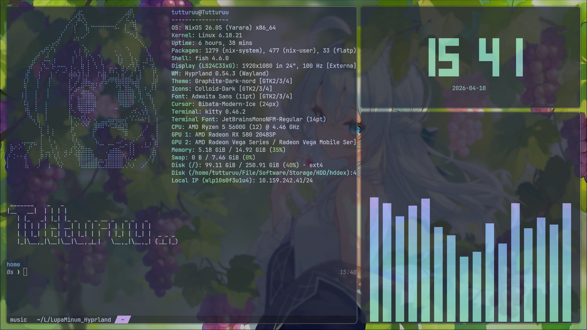
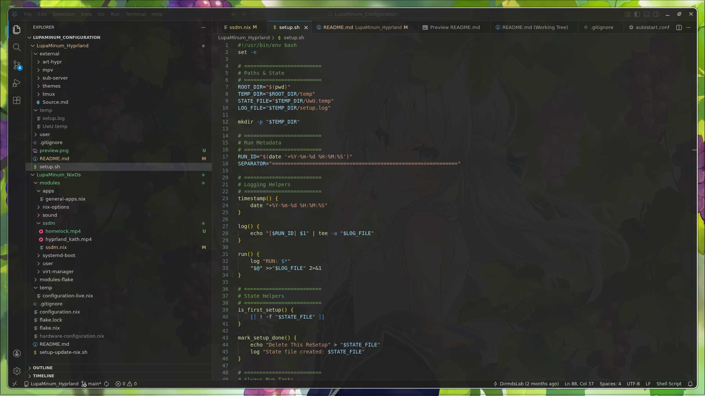

# Personal OS - Hyprland

## Struktur Project

```bash
.
├── external/           # Additional configs & resources
│   ├── art-hypr/
│   ├── mpv/
│   ├── sub-server/
│   ├── themes/
│   └── tmux/
│
├── temp/               # Temporary files / setup logs
│   ├── setup.log
│   └── UwU.temp
│
├── user/               # User dotfiles & configurations
│   ├── .config/        # Main application configs (Hyprland, mpv, etc.)
│   ├── .local/         # App shortcut
│   ├── .nanorc         # Nano editor configuration
│   ├── .tmux.conf      # Tmux configuration
│   └── File/           # Script/custom file
│
├── setup.sh            # Installation/setup script
└── README.md
```

## Bruh
Preview video? Ricing? Not yet, 90% gui still similar to basic hyprland, I just added keybind, script, mpv, mpvpaper, themes, etc.

bar? my quickshell still hello world :v
### Preview 

### Codium
